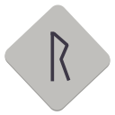

# Runa

Runa is a desktop launcher designed to manage accounts and start compatible Java-based game clients for a certain old-school MMORPG, built with GTK4 and libadwaita for seamless integration with modern GNOME desktops.

## Install

## License

This project is licensed under the BSD-3-Clause license.
